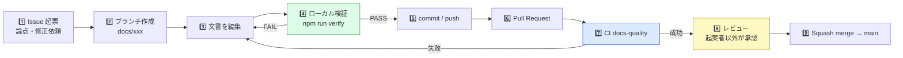

# 📝 文書の更新手順（CONTRIBUTING）

本リポジトリは **みらいAIエージェント事業推進基盤のドキュメント正本** です。
アプリケーションの新規開発は行いません（README「このリポジトリは何か」参照）。
したがってここでの「開発」とは **文書を安全に更新し、履歴を残し、レビューを通すこと** を指します。

---

## 🧭 主要な流れ（Documentation User Journey）



> ⚠️ **`main` へ直接 commit / push しない。** 変更は必ず Pull Request を経由します（`起案者 ≠ 最終承認者`）。

---

## 0️⃣ 前提

| 必要なもの | 内容 |
|---|---|
| Node.js | v20 以上（検証は v22 で実施）。**外部パッケージのインストールは不要**（依存ゼロ） |
| Git | ブランチ作成・PR 作成ができること |

```bash
git clone https://github.com/Kensan196948G/Mirai-AI-Agent-Business-Platform.git
cd Mirai-AI-Agent-Business-Platform
npm run verify   # npm install は不要
```

---

## 1️⃣ Issue を起票する

| 用途 | テンプレート |
|---|---|
| Q1〜Q7 / P-1〜P-12 など決定が必要な論点 | 「決定事項（Q / P）の起票」 |
| 文書の誤り・不足・更新依頼 | 「文書の追加・修正」 |

> Gate 1〜5 の**正式承認は GitHub Issue では行いません**。承認の正本は desknet's NEO Workflow、案件・Phase・Gate 状態の正本は AppSuite です。

---

## 2️⃣ ブランチを作成する

| 接頭辞 | 用途 |
|---|---|
| `docs/` | 文書の追加・修正 |
| `feat/` | 仕組み（CI・テンプレート・検証スクリプト）の追加 |
| `fix/` | 誤記・リンク切れ・整合性の修正 |
| `chore/` | 設定・雑務 |

```bash
git switch -c docs/update-saas-setup-guide
```

---

## 3️⃣ 文書を編集する

### 正本のルール

| 種別 | 正本 | 補足 |
|---|---|---|
| プロセス定義 | `docs/ai-dx-dev-process.md` | 確定版。変更は影響範囲を明記する |
| SaaS構築計画 | `docs/ai-dx-dev-saas-setup-guide.md` | レビュー版。P-1〜P-12 が決定待ち |
| 各ツール設定手順 | 「公式マニュアル追記版.html」 | 無印版は概要（ELI5）。**作業時は追記版が正** |
| 決定状況（Q / P） | 計画書 第7章 ＋ README ステータス表 | **両方を同時に更新する**（CI が一致を検査する） |

### 守ること

- 🚫 secret / credential / token / 個人情報 / 社外秘を本文へ書かない（メールアドレスの例示は `@example.com` を使う）
- 🚫 `.env` や資格情報ファイルを追加しない
- ✅ `.md` を更新したら、配布用 `.html` の再生成要否を判断する（`.md` と `.html` の内容が乖離しないようにする）
- ✅ 他文書と矛盾する記述を作らない（README「正本マップ」を確認する）

---

## 4️⃣ ローカルで検証する

```bash
npm run verify      # 文書整合性チェック + ユニットテスト
npm run check       # 文書整合性チェックのみ
npm test            # ユニットテストのみ
```

### 検査ルール

| ルール | 内容 | 重大度 |
|---|---|:---:|
| `DOC001` | 文書内で参照しているファイル（`.md` / `.html` / `.pptx`）が実在するか | error |
| `DOC002` | `docs/` 配下の `.md` に対になる `.html` があるか | warn |
| `DOC003` | 秘密情報・個人情報らしき文字列が混入していないか（**検出値は表示しない**） | error |
| `DOC004` | 「## 文書情報」を持つ文書に「ステータス」行があるか | error |
| `DOC005` | Q1〜Q7 / P-1〜P-12 の ID が README と計画書 第7章で一致するか | error |
| `DOC006` | h1 見出しが 1 文書に 1 つだけか | error |

`DOC003` で指摘された場合は、**値を Slack や Issue に貼り付けず**、該当箇所を除去・匿名化してください。実在の資格情報を誤って push した場合は、除去だけでなく **rotation（再発行）** が必要です。

---

## 5️⃣ commit する

Conventional Commits を使います。

```
docs: SaaS構築計画書のP-2にパイロット案件のKPI案を追記
fix: README の正本マップのリンク切れを修正
feat: 文書整合性チェックにDOC005を追加
chore: Issueテンプレートを追加
```

---

## 6️⃣ Pull Request を作成する

PR テンプレートの各項目（目的 / 変更 / 対象外 / 影響 / テスト・CI / セキュリティ / 正本・整合性 / 承認・SOD / 残課題 / production-safe）を埋めます。

---

## 7️⃣ CI（`docs-quality`）

Pull Request と `main` への push で自動実行されます。

| ステップ | 内容 |
|---|---|
| 依存関係の確認 | 外部依存ゼロが維持されているか（supply-chain リスクの抑止） |
| ユニットテスト | 検証スクリプト自体が正しく動くか（`node --test`） |
| 文書整合性チェック | `DOC001`〜`DOC006` |
| `.env` 検査 | `.env` が Git 管理下に無いこと |

---

## 8️⃣ レビューと 9️⃣ マージ

- レビューは **起案者以外** が行います（SOD：`開発者 ≠ Pull Request 最終承認者`）。
- マージは **Squash merge** で 1 変更 1 コミットに集約します。
- CI が失敗している PR はマージしません。

---

## 🙅 やってはいけないこと

- 🚫 `main` への直接 commit / push、force push、`--no-verify`
- 🚫 CI や検査ステップを無効化して通すこと
- 🚫 他人の未コミット変更・未追跡ファイルを勝手に削除・stash すること
- 🚫 Slack の「OK」を正式承認として扱うこと

---

## 🤖 AI（Claude / Claude Code）を使う場合

- AI は**提案・整理・作文の支援のみ**。**承認はしません**（`AI ≠ 承認者`）。
- AI が生成した文書も、必ず人間がレビューしてから merge します。
- AI へ入力してよい情報の線引きは **P-5（AI利用ルール・情報管理方針）** の決定に従います。決定前は、社外秘・個人情報を入力しないでください。
