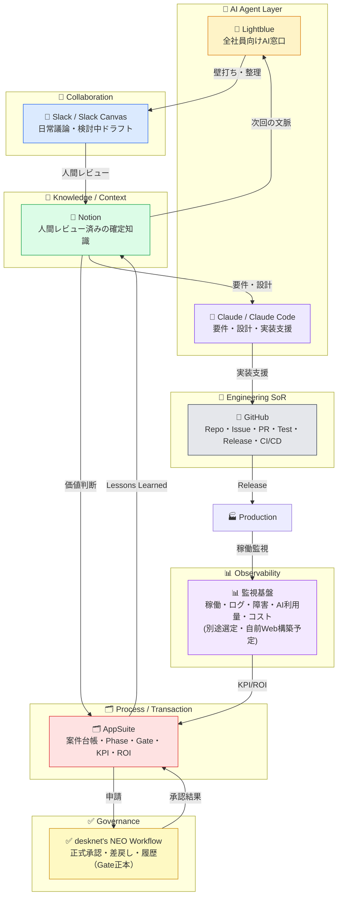
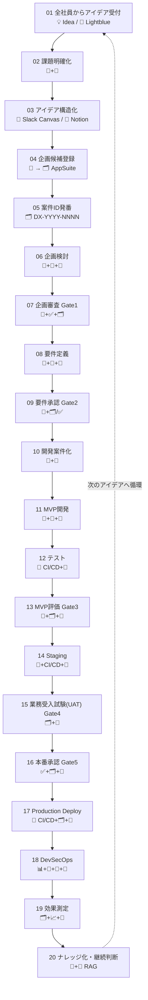
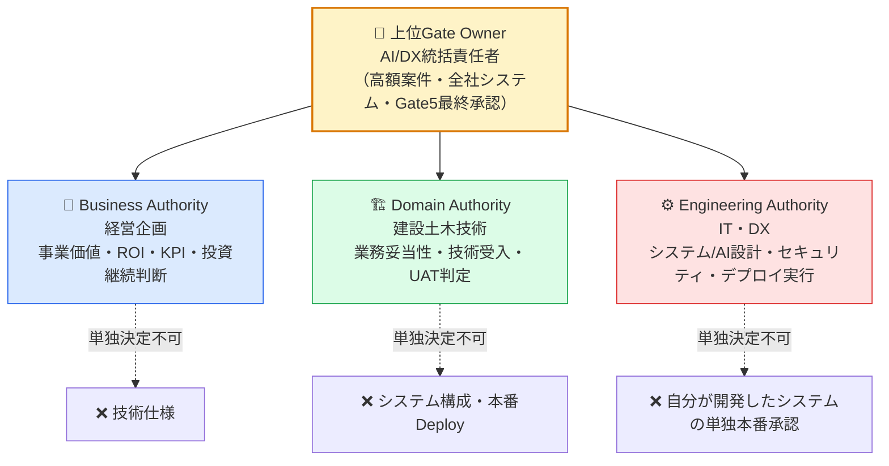
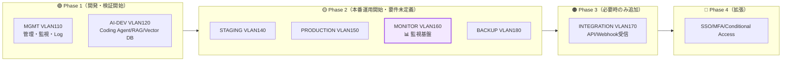

# 🚀 みらい AIエージェント事業推進基盤（Mirai AI Agent Business Platform）

> 全社員のアイデアを「壁打ち → 企画 → 承認 → 開発 → 本番 → 効果測定 → ナレッジ循環」で回す、**AIエージェント型の事業本部基盤**。
> 自前アプリの新規開発は行わず、既存SaaS（Lightblue / Slack / Notion / AppSuite / desknet's NEO / GitHub）の設定・連携で構築する。


-informational)

---

## 📚 目次

1. [🎯 このリポジトリは何か](#-このリポジトリは何か)
2. [🏛️ 全体アーキテクチャ](#️-全体アーキテクチャ)
3. [🔁 Knowledge Feedback Loop](#-knowledge-feedback-loop)
4. [🚦 5 Stage Gate（進捗承認ゲート）](#-5-stage-gate進捗承認ゲート)
5. [🧭 20フェーズのAI/DX開発プロセス](#-20フェーズのaidx開発プロセス)
6. [⚖️ 3つのAuthority と SOD](#️-3つのauthority-と-sod)
7. [🧩 各ツールの役割](#-各ツールの役割)
8. [🌐 インフラ構成（Phase別拡張）](#-インフラ構成phase別拡張)
9. [🗂️ リポジトリ構成](#️-リポジトリ構成)
10. [📖 ドキュメント間の関係（正本マップ）](#-ドキュメント間の関係正本マップ)
11. [✅ 現在のステータス（Q1〜Q7 / P-1〜P-12）](#-現在のステータスq1q7--p-1p-12)
12. [🙅 絶対に守るルール（SOD）](#-絶対に守るルール sod)

---

## 🎯 このリポジトリは何か

| 項目 | 内容 |
|---|---|
| 🎯 目的 | 全社員の「困りごと」をAIとの壁打ちから事業・業務・システムへ変換する仕組みを、**人が必ず承認する（Human-in-the-Loop）**設計で構築する |
| 🧱 開発方針 | **自前アプリの新規開発なし**。既存契約済みSaaS（AppSuite / desknet's NEO / Notion / Lightblue / Slack）への設定・テンプレート投入で構築する |
| 🔭 唯一の将来コード開発対象 | 監視基盤（自前Web構築予定）。ただし本計画のスコープ外・Phase 2・要件未定義（下記「現在のステータス」章のP-6を参照） |
| 📁 このリポジトリの中身 | 企画書・プロセス定義・SaaS構築計画書・各ツール設定手順書（すべて`docs/`配下） |
| 🏢 正本管理 | GitHub（本リポジトリ）をドキュメントの正本とする |

---

## 🏛️ 全体アーキテクチャ

各ツールは役割が明確に分離されており、**Slackを稟議システム化せず、AppSuiteをチャット化しない**のが設計の肝。



> 💡 **各情報の正本**：AIとの相談＝Lightblue／検討中ドラフト＝Slack Canvas／確定知識＝Notion／案件・Phase・Gate＝AppSuite／承認＝desknet's NEO Workflow／ソースコード・Issue・PR＝GitHub／稼働監視＝監視基盤（別途選定）。

---

## 🔁 Knowledge Feedback Loop

「会話をそのまま覚えさせる」のではなく、**会話 → AI整理 → 人間レビュー → Notionへ確定知識化**する循環を回す。

```mermaid
flowchart LR
    A["👥 全社員"] --> B["🤖 Lightblue<br/>AI壁打ち"]
    B --> C["💬 Slack Canvas"]
    C --> D["📓 Notion<br/>Idea / 確定Knowledge"]
    D --> E["👔 AXWG<br/>→ 3 Authority"]
    E --> F["🗂️ AppSuite<br/>正式案件・Portfolio台帳"]
    F --> G["✅ desknet's NEO Workflow<br/>Gate審査・承認"]
    G --> H["📓 Notion<br/>要件・意思決定"]
    H --> I["🧠 Claude / Claude Code"]
    I --> J["🐙 GitHub<br/>開発・テスト・Release"]
    J --> K["🧪 MVP / Staging (UAT)"]
    K --> L["🏭 Gate 5 → Production RC → Production Deploy"]
    L --> M["📊 監視基盤 (DevSecOps)"]
    M --> N["📈 AppSuite / BI<br/>KPI・ROI"]
    N --> O["📓 Notion<br/>Lessons Learned"]
    O -.->|次回相談の文脈| B

    style A fill:#f9fafb,stroke:#6b7280
    style D fill:#dcfce7,stroke:#16a34a
    style H fill:#dcfce7,stroke:#16a34a
    style O fill:#dcfce7,stroke:#16a34a
    style G fill:#fef9c3,stroke:#ca8a04
    style F fill:#fee2e2,stroke:#dc2626
    style N fill:#fee2e2,stroke:#dc2626
    style J fill:#e5e7eb,stroke:#374151
```



---

## 🚦 5 Stage Gate（進捗承認ゲート）

**「Slackで承認したから開発開始」は禁止。** 必ず `Slack（検討）→ AppSuite（正式申請）→ desknet's NEO Workflow（正式承認）→ GitHub（開発開始）` の順で進める。

```mermaid
flowchart LR
    Idea(["💡 Idea<br/>AI壁打ち・検討Canvas"]) --> Planning
    Planning(["📝 Planning<br/>企画書・As-Is/To-Be"]) --> G1{{"🚪 Gate 1<br/>企画承認"}}
    G1 --> Definition(["📐 Definition<br/>要件定義・リスク評価"])
    Definition --> G2{{"🚪 Gate 2<br/>開発承認"}}
    G2 --> MVP(["🛠️ MVP<br/>開発・検証"])
    MVP --> G3{{"🚪 Gate 3<br/>MVP承認"}}
    G3 --> Staging(["🧪 Staging<br/>結合試験・UAT"])
    Staging --> G4{{"🚪 Gate 4<br/>本番移行承認"}}
    G4 --> RC(["🏷️ Production RC<br/>承認済みタグ"])
    RC --> G5{{"🚪 Gate 5<br/>Release承認"}}
    G5 --> Prod(["🏭 Production<br/>本番Deploy"])
    Prod --> Ops(["🔄 Operation<br/>DevSecOps・効果測定"])
    Ops -.->|継続/改善/停止判定| Idea

    style G1 fill:#fef9c3,stroke:#ca8a04
    style G2 fill:#fef9c3,stroke:#ca8a04
    style G3 fill:#fef9c3,stroke:#ca8a04
    style G4 fill:#fef9c3,stroke:#ca8a04
    style G5 fill:#fef9c3,stroke:#ca8a04
    style Prod fill:#fee2e2,stroke:#dc2626
```



| Gate | Phase | 承認の主な関与者 |
|---|---|---|
| **Gate 1** 🚪 企画承認 | Planning | 💼 経営企画（主）＋🏗️ ドメイン＋⚙️ IT/DX |
| **Gate 2** 🚪 開発承認 | Definition | 🏗️ ドメイン＋⚙️ IT/DX（技術仕様はドメイン承認） |
| **Gate 3** 🚪 MVP承認 | MVP | 🏗️ ドメイン＋⚙️ IT/DX（経営企画は最終承認） |
| **Gate 4** 🚪 本番移行承認 | Staging | 🏗️ ドメイン（UAT受入）＋💼 経営企画（移行判定） |
| **Gate 5** 🚪 Release承認 | Production RC | 👑 上位Gate Owner（DX統括）＋⚙️ IT/DX |

> ⚠️ **本番環境では開発しない。** MVP/DEV → Staging → Production RC → Release承認 → Production Deploy の順で進め、承認済みRelease TagのみをDeployする。

---

## 🧭 20フェーズのAI/DX開発プロセス



<details>
<summary>📋 各フェーズの詳細を見る（クリックで展開）</summary>

| # | フェーズ | Stage | 主担当 |
|---|---|---|---|
| 01 | 全社員からアイデア受付 | Idea | 🤖 Lightblue |
| 02 | 課題明確化 | Idea | 🤖 Lightblue + 📓 Notion |
| 03 | アイデア構造化 | Idea | 🤖 → 💬 Slack Canvas / 📓 Notion |
| 04 | 企画候補登録 | Planning | 📓 → 🗂️ AppSuite |
| 05 | 案件ID発番（例：`DX-2026-0042`） | Planning | 🗂️ AppSuite |
| 06 | 企画検討（決定/未決/次アクション整理） | Planning | 💬 + 🧠 Claude + 📓 |
| 07 | 企画審査（**Gate 1**） | Gate 1 | 📓 + ✅ Workflow + 🗂️ AppSuite |
| 08 | 要件定義（業務要件・非機能要件） | Definition | 🧠 Claude + 💬 + 📓 |
| 09 | 要件承認（**Gate 2**） | Gate 2 | 📓 + 🗂️/✅ |
| 10 | 開発案件化（Repository/Project/Issue発行） | MVP/DEV | 🐙 GitHub + 📓 |
| 11 | MVP開発 | MVP/DEV | 🧠 Claude Code + 🐙 + 📓 |
| 12 | テスト（Lint/Unit/脆弱性/Secret Scan） | MVP/DEV | 🐙 CI/CD + 📓 |
| 13 | MVP評価（**Gate 3**、KPI測定） | Gate 3 | 💬 + 🗂️ + 📓 |
| 14 | Staging（マスキング済みテストデータ） | Staging | 🐙 CI/CD + 📓 |
| 15 | 業務受入試験 UAT（**Gate 4**） | Gate 4 | 🗂️ + 📓 |
| 16 | 本番承認（**Gate 5**、Release Candidate確定） | Gate 5 | ✅ + 🗂️ + 📓 |
| 17 | Production Deploy（承認済みRelease Tagのみ） | Production | 🐙 CI/CD + 🗂️ + 📓 |
| 18 | DevSecOps（監視 → Slack通知 → GitHub Issue） | Operation | 📊 + 💬 + 🐙 + 📓 |
| 19 | 効果測定（KPI/ROI、Why it happened） | Operation | 🗂️ + 📈 BI + 📓 |
| 20 | ナレッジ化・継続判断（継続/改善/停止） | Knowledge | 📓 + 🤖 Lightblue RAG |

</details>

---

## ⚖️ 3つのAuthority と SOD

**AIは承認できない。承認は必ず人間が行う。** 企画・承認・開発・運用の権限を分離することでガバナンスを維持する。



### RACI（抜粋）

| 行為 | 💼 経営企画 | 🏗️ ドメイン | ⚙️ IT/DX |
|---|:---:|:---:|:---:|
| 事業価値評価 | **A** | C | C |
| 技術妥当性 | C | **A** | C |
| システム実現性 | C | C | **A** |
| 要件定義 | A | **R** | **R** |
| セキュリティ評価 | C | C | **R** |
| コーディング | ― | C | **R** |
| コードレビュー | ― | C（必要時） | R（**別のIT担当**） |
| UAT | C | **R** | C（支援） |
| Production Deploy | ― | ― | **R** |
| 継続 / 停止判断 | **A** | C | C |

`R`=実行　`A`=最終責任・承認　`C`=助言・参画

---

## 🧩 各ツールの役割

| アイコン | ツール | レイヤ | 役割 | 状態 |
|:---:|---|---|---|:---:|
| 🤖 | **Lightblue** | AI Agent Layer | 全社員向けAI窓口。壁打ち・要約・分類・企画化支援・Notionナレッジ検索 | 契約済み（機能範囲は方針決定・確認中） |
| 💬 | **Slack / Slack Canvas** | Collaboration | 日常会話・検討中ドキュメント（共同編集）。**議論参加は3名のみ** | 決定済み |
| 📓 | **Notion** | Knowledge / Context | 人間レビュー済みの確定知識（Idea/決定事項/要件/教訓）を保存 | 導入決定 |
| 🗂️ | **AppSuite** | Process / Transaction | 案件ID・Phase・Gate・責任者・KPI・ROIのAI事業ポートフォリオ台帳 | 構築済み・機能確認済み |
| ✅ | **desknet's NEO Workflow** | Governance | 正式申請・段階的承認・差戻し・審査履歴（**Gate承認の正本**） | 決定済み |
| 🧠 | **Claude / Claude Code** | Expert AI | 高度分析・要件定義・設計・レビュー・実装/テスト支援 | 利用中 |
| 🐙 | **GitHub** | Engineering SoR | Repository・Issue・PR・Test・Release・CI/CD（Webhookは必要時のみ） | 本リポジトリで運用開始 |
| 📊 | **監視基盤** | Observability | 稼働・ログ・障害・AI利用量・コストの継続監視（**ツールは別途選定・自前Web構築予定**） | ⏳ 未着手（下記P-6参照） |

> 🔮 **将来拡張**：AIを1体の万能Botにせず、`AI Orchestrator`配下に専門エージェント（Idea Agent / Planning Agent / Business Analysis Agent / Requirement Agent / Architecture Agent / Security Agent / Coding Agent / QA Agent / Release Agent / Knowledge Agent）を配置する構想。ユーザーからは単一のAI窓口に見える構成。

---

## 🌐 インフラ構成（Phase別拡張）

自前Web監視基盤等の将来コンポーネント用に、VLANアドレス空間が段階的に設計されている（`docs/AIDX開発基盤インフラ・ネットワーク構成設計書.html`）。



> ⚠️ この設計書は**VLANアドレス空間の予約（設計）のみ承認済み**。MONITOR（監視基盤）の実際の構築着手は、`ai-dx-dev-saas-setup-guide.md` **P-6**（誰が・いつ作るか）の決定が起票条件。

---

## 🗂️ リポジトリ構成

```text
Mirai-AI-Agent-Business-Platform/
├── 📄 README.md                                          ← このファイル
├── 🙈 .gitignore
└── 📁 docs/
    ├── 📘 ai-dx-dev-process.md / .html                    ← 🏛️ プロセス定義（確定版・正本）
    ├── 📗 ai-dx-dev-saas-setup-guide.md / .html            ← 🏗️ SaaS構築・設定計画書（レビュー版v0.5）
    ├── 📙 ai-dx-dev-build-guide.html                       ← 🔧 Phase 01〜20 構築内容（Draft版）
    ├── 🌐 AIDX開発基盤インフラ・ネットワーク構成設計書.html   ← 🖧 VLAN/ネットワーク設計（承認版）
    ├── 📊 ワーキング発足に関する企画書.pptx                  ← 🚀 発足企画書
    └── 📁 ツール利用・設定マニュアル/
        ├── 🗂️ AppSuite.html                                        （ELI5概要版）
        ├── 🗂️ AppSuite 設定手順書 公式マニュアル追記版.html          ⭐ 作業時はこちらが正
        ├── ✅ NEO-Workflow.html                                    （ELI5概要版）
        ├── ✅ desknet's NEO ワークフロー 設定手順書 公式マニュアル追記版.html ⭐
        ├── 📓 Notion.html                                          （ELI5概要版）
        ├── 📓 Notion 設定手順書公式マニュアル追記版.html             ⭐
        ├── 🤖 Lightblue.html                                       （ELI5概要版）
        ├── 🤖 Lightblue 設定手順書公式マニュアル追記版.html          ⭐
        ├── 💬 Slack.html                                           （ELI5概要版）
        ├── 💬 Slack 設定手順書公式マニュアル追記版.html              ⭐
        ├── 🔄 CSV・ファイル取込設定手順書公式マニュアル統合版.html   ← 複数ツール横断のCSV/マスタ投入手順
        └── 🔄 ai-dx-dev-csv-import-guide.md / .html
```

---

## 📖 ドキュメント間の関係（正本マップ）

```mermaid
flowchart TD
    PROC["📘 ai-dx-dev-process.md<br/>全体プロセス定義（確定版）"]
    SETUP["📗 ai-dx-dev-saas-setup-guide.md<br/>SaaS構築計画（レビュー版v0.5）"]
    BUILD["📙 ai-dx-dev-build-guide.html<br/>Phase別構築内容（Draft）"]
    INFRA["🌐 インフラ・ネットワーク構成設計書<br/>（承認版＝VLAN予約のみ）"]
    MANUAL["🗂️✅📓🤖💬 各ツール設定手順書<br/>（公式マニュアル追記版が正）"]
    CSV["🔄 CSV・ファイル取込統合版"]

    PROC -->|Phase定義を実装項目へ分解| SETUP
    SETUP -->|Phase構築内容の詳細分解| BUILD
    SETUP -->|各ツール設定の詳細手順| MANUAL
    SETUP -->|複数ツール横断のCSV投入手順| CSV
    SETUP -.->|監視基盤VLAN予約(P-6)| INFRA

    style PROC fill:#dbeafe,stroke:#2563eb,stroke-width:2px
    style SETUP fill:#dcfce7,stroke:#16a34a,stroke-width:2px
```

| 文書 | ステータス | 役割 |
|---|:---:|---|
| `ai-dx-dev-process.md`（+`.html`） | ✅ 確定版 | 全体プロセス定義。20フェーズ・5 Gate・3 Authority・SODの正本 |
| `ai-dx-dev-saas-setup-guide.md`（+`.html`） | 🟡 レビュー版v0.5 | 上記を既存SaaS上での構築・設定計画へ分解。P-1〜P-12が意思決定待ち |
| `ai-dx-dev-build-guide.html` | 🟠 Draft | Phase 01〜20ごとの構築内容・完了条件 |
| インフラ・ネットワーク構成設計書 | ✅ 承認版（VLAN設計のみ） | 監視基盤等の将来コンポーネント用ネットワーク受け皿 |
| 各ツール「公式マニュアル追記版」 | ⭐ 最新 | 実際の画面操作・公式マニュアル引用を含む実務手順（無印版は概要ELI5） |

---

## ✅ 現在のステータス（Q1〜Q7 / P-1〜P-12）

### Q1〜Q7（基本方針）

| Q | 論点 | 状態 |
|---|---|:---:|
| Q1 | Knowledge基盤 → Notion導入 | ✅ 決定済み |
| Q2 | Collaboration → 通知はNEO、Slack議論は3名のみ | ✅ 決定済み |
| Q3 | 承認の実行場所 → desknet's NEO Workflow | ✅ 決定済み |
| Q4 | GitHub・Webhook → 必要な時のみ利用 | ✅ 決定済み |
| Q5 | 認証 → 当面パスワード、将来SSO | ✅ 決定済み（当面運用） |
| Q6 | Lightblueの機能範囲 | 🟡 方針決定済み・ベンダー確認は未実施 |
| Q7 | 監視ツール → 自前Web構築予定 | ✅ 決定済み（別途計画・下表P-6参照） |

### P-1〜P-12（追加決定ポイント）

| # | 論点 | 状態 |
|---|---|:---:|
| P-1 | Gate 5最終承認者（上位Gate Owner） | ⏳ 未決 |
| P-2 | パイロット案件の選定・KPI | ⏳ 未決 |
| P-3 | NEO ⇄ AppSuiteの反映方法（手動/自動） | ⏳ 未決 |
| P-4 | 「提案者」の範囲 | ⏳ 未決 |
| P-5 | AI利用ルール・情報管理方針 | ⏳ 未決 |
| P-6 | 📊 監視基盤の計画（誰が・いつ） | ⏳ 未決（ネットワーク受け皿は設計済み） |
| P-7 | 将来のSSO導入時期・対象 | ⏳ 未決 |
| P-8 | 3名の兼任ルール | ⏳ 未決（企画書pptxに暫定案あり・要突合） |
| P-9 | パイロット案件のAI入力可否（個人情報/位置情報） | ⏳ 未決 |
| P-10 | 監視基盤の監視項目・通知先 | ⏳ 未決 |
| P-11 | 3名のアカウント・権限レベル | ⏳ 未決 |
| P-12 | 文書・設定のバックアップと引継ぎ | ⏳ 未決 |

> 📌 詳細は `docs/ai-dx-dev-saas-setup-guide.md` 第7章を参照。P-1〜P-12は💼🏗️⚙️ 3 Authorityによるレビュー・決定が必要な事項であり、本リポジトリのドキュメント整備だけでは解決しない。

---

## 🙅 絶対に守るルール（SOD）

- 🚫 `企画者 ≠ 企画最終承認者`
- 🚫 `開発者 ≠ Pull Request最終承認者`
- 🚫 `開発者 ≠ Productionリリース最終承認者`
- 🚫 `AI ≠ 承認者`（AIは提案・支援のみ、承認は必ず人間）
- 🚫 `技術評価者 ≠ 経営投資判断者`
- 🚫 `Slack上の「OK」≠ 正式承認`（正式承認は desknet's NEO Workflow / AppSuite の記録のみ）

---

<div align="center">

**「AIを使う会社」ではなく、「社員の発想をAIが組織的に事業・システムへ変換する会社」を目指す。**

</div>
