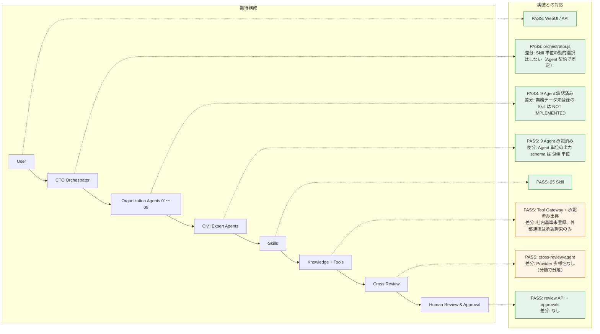

# Agent / Skills / AI Runtime 全機能検証報告

対象: `Kensan196948G/Mirai-AI-Agent-Business-Platform`（app/）／ 基準: `docs/Agent-Skills-AI-Runtime-Full-Verification-Checklist.md` ／ 最終更新: 2026-09-09（第 5 段、最終）

## Executive Summary

- 判定項目 627 件: PASS 511 / PARTIAL 95 / FAIL 0 / NOT IMPLEMENTED 21 / NOT APPLICABLE 0
- 実装率（PASS=1、PARTIAL=0.5）: **89.1%**
- 期待アーキテクチャ（User → CTO Orchestrator → Organization Agents 01〜09 → Civil Expert Agents → Skills → Knowledge + Tools → Cross Review → Human Review & Approval）は **本番で一気通貫に稼働**（ORC-1001: technology-selection → geotechnical-expert → cross-review-agent → 統合草案 ART-1027、専門技術者レビュー必須）
- 判定: **CONDITIONAL（Production Ready with conditions）**。条件は §残存リスク（Provider 多様性、社内基準・業務データ未登録、本番のデモ案件、外部連携の実接続）

## 検証の進め方

| 段 | 内容 | PR |
|---|---|---|
| 第 1 段 | 司令塔（計画・複数 Run・統合・上限・監査） | #44 |
| 第 2 段 | 組織責務 Agent 01〜09 + 共通 Skill 9 種 | #45 |
| 第 3 段 | 土木専門 Agent 9 種 + 専門 Skill 3 種 + 技術リスク T1〜T6 の強制 + 委譲（第 2 段の params 欠陥修正を含む） | #46 |
| 第 4 段 | Cross Review（独立レビュー、判定の強制、Evidence 化） | #47 |
| 第 5 段 | 残項目の是正（承認期限・差戻し・理由必須、Tool 結果 schema、Circuit Breaker、pagination、タイムアウト、IDOR）+ 全項目判定 | #48 |

判定基準: 実コード・DB・API・Worker・WebUI・テストで動作することを確認したものだけを PASS とする。文書や設定画面だけのものは PASS にしない。PARTIAL / NOT IMPLEMENTED には根拠欄に原因・対象・修正方針を記す。

## 実装率（領域別）

| 領域 | 件数 | PASS | PARTIAL | FAIL | NOT IMPL | N/A | 実装率 |
|---|---|---|---|---|---|---|---|
| A. 全体アーキテクチャ整合性 | 15 | 14 | 1 | 0 | 0 | 0 | 97% |
| B. CTO Orchestrator | 25 | 22 | 3 | 0 | 0 | 0 | 94% |
| C01. 組織責務 Agent 01 | 9 | 7 | 2 | 0 | 0 | 0 | 89% |
| C02. 組織責務 Agent 02 | 8 | 5 | 1 | 0 | 2 | 0 | 69% |
| C03. 組織責務 Agent 03 | 9 | 3 | 5 | 0 | 1 | 0 | 61% |
| C04. 組織責務 Agent 04 | 9 | 6 | 2 | 0 | 1 | 0 | 78% |
| C05. 組織責務 Agent 05 | 8 | 6 | 1 | 0 | 1 | 0 | 81% |
| C06. 組織責務 Agent 06 | 8 | 4 | 3 | 0 | 1 | 0 | 69% |
| C07. 組織責務 Agent 07 | 8 | 4 | 3 | 0 | 1 | 0 | 69% |
| C08. 組織責務 Agent 08 | 9 | 4 | 2 | 0 | 3 | 0 | 56% |
| C09. 組織責務 Agent 09 | 9 | 4 | 3 | 0 | 2 | 0 | 61% |
| D. Civil Expert Agents | 20 | 18 | 2 | 0 | 0 | 0 | 95% |
| E. Agent Registry / Contract | 24 | 21 | 3 | 0 | 0 | 0 | 94% |
| F. Skills / Skill Registry | 30 | 22 | 8 | 0 | 0 | 0 | 87% |
| G. Knowledge | 20 | 17 | 3 | 0 | 0 | 0 | 92% |
| H. Tool Gateway | 25 | 18 | 7 | 0 | 0 | 0 | 86% |
| I. Policy Engine | 24 | 20 | 3 | 0 | 1 | 0 | 90% |
| J. Human Review & Approval | 20 | 20 | 0 | 0 | 0 | 0 | 100% |
| K. Cross Review | 18 | 13 | 5 | 0 | 0 | 0 | 86% |
| L. Provider Adapter / Model Router | 24 | 17 | 6 | 0 | 1 | 0 | 83% |
| M. Prompt Guard | 15 | 13 | 2 | 0 | 0 | 0 | 93% |
| N. Runtime / Worker / Queue | 30 | 25 | 5 | 0 | 0 | 0 | 92% |
| O. Artifact / Evidence / Lineage | 17 | 16 | 0 | 0 | 1 | 0 | 94% |
| P. Audit / Observability | 30 | 26 | 3 | 0 | 1 | 0 | 92% |
| Q. AuthN / AuthZ / SoD | 22 | 21 | 1 | 0 | 0 | 0 | 98% |
| R. Database / Migration | 20 | 17 | 3 | 0 | 0 | 0 | 92% |
| S. API | 20 | 17 | 3 | 0 | 0 | 0 | 92% |
| T. WebUI | 20 | 17 | 3 | 0 | 0 | 0 | 92% |
| U. External Integrations | 16 | 6 | 5 | 0 | 5 | 0 | 53% |
| V. Security | 30 | 24 | 6 | 0 | 0 | 0 | 90% |
| W. Test Suite | 30 | 30 | 0 | 0 | 0 | 0 | 100% |
| X. 建設土木ドメイン固有テスト | 20 | 19 | 1 | 0 | 0 | 0 | 98% |
| Y. 完全実装判定 | 15 | 15 | 0 | 0 | 0 | 0 | 100% |
| Z. 最終成果物 | 20 | 20 | 0 | 0 | 0 | 0 | 100% |
| **合計** | 627 | 511 | 95 | 0 | 21 | 0 | **89.1%** |

| チェックリスト Z の指標 | 対象領域 | 実装率 |
|---|---|---|
| Z-003 アーキテクチャ | A. B. K. N. O. | 92%（PASS 90 / PARTIAL 14 / NI 1） |
| Z-004 Organization Agent | C0 | 70%（PASS 43 / PARTIAL 22 / NI 12） |
| Z-005 Civil Agent | D. X. | 96%（PASS 37 / PARTIAL 3 / NI 0） |
| Z-006 Skills | E. F. G. H. | 89%（PASS 78 / PARTIAL 21 / NI 0） |
| Z-007 Policy / Approval | I. J. | 94%（PASS 40 / PARTIAL 3 / NI 1） |
| Z-008 Security | M. Q. V. S. | 93%（PASS 75 / PARTIAL 12 / NI 0） |

## 全項目判定

### A. 全体アーキテクチャ整合性

| ID | 判定 | 根拠・原因・修正方針 |
|---|---|---|
| A-001 | PASS | `orchestrator.js` → `run-create.js` → `workflow-engine.js` → `skills/index.js` → `tool-gateway.js` → cross-review → `routes/artifacts.js`（review）。E2E「司令塔」「土木専門 Agent」「Cross Review」 |
| A-002 | PASS | 各層は DB（orchestrations / agent_runs / run_events / artifacts / approval_requests）と API に結び付く |
| A-003 | PASS | `domain-packs/mirai-construction/agents/*.yaml` と `skills/*/`（SKILL.md + execution.yaml + schemas + evals） |
| A-004 | PASS | Agent 契約 `layer`（organization / civil_expert / cross_review）、org-map.yaml の organizations / civil_experts / cross_review |
| A-005 | PASS | Agent は skills[] の順序と params だけを持ち、処理は Skill ハンドラ |
| A-006 | PASS | 共通 Skill 9 種 + 専門 Skill 3 種を複数 Agent が params 付きで共用 |
| A-007 | PASS | Skill は `ctx.callTool(knowledge.search-approved / search-promoted / source.read-approved-snapshot / artifact.write-draft)` を明示呼出し |
| A-008 | PASS | cross-review-agent は独立層。司令塔が最終 Step として付与 |
| A-009 | PASS | approval_gate（waiting_approval）、T3 以上の expert_confirmed、T5/T6 の expert_note、Policy DENY。否定系 E2E |
| A-010 | PASS | run_code / orchestration_id / orchestration_step_id / project_id / artifact_code / approval_code |
| A-011 | PASS | 失敗時も run_events（error）と audit（orchestration.finish に失敗 Step を記録） |
| A-012 | PARTIAL | Idempotency Key は無い。同一 Run・同一 kind の草案は冪等、同時実行・日次上限で暴走を抑止。修正方針: run 作成 API に `Idempotency-Key` ヘッダ（第 6 段候補） |
| A-013 | PASS | 再実行は rerun_of_run_id と lineage（previous_artifact_id / lineage_version）で追跡、差分表示 |
| A-014 | PASS | Project の状態遷移（`lib/workflow.js`）と approval_requests を Agent Runtime と共用 |
| A-015 | PASS | README「何が本物で、何がまだ人手か」と本報告を実装に合わせて更新（Y-014） |

### B. CTO Orchestrator

| ID | 判定 | 根拠・原因・修正方針 |
|---|---|---|
| B-001 | PASS | `src/agent-runtime/orchestrator.js` |
| B-002 | PASS | `POST /api/orchestrations {request}` |
| B-003 | PASS | intent（LLM 計画 / ルールベースは「相談 / 未分類」） |
| B-004 | PASS | catalog の executable かつ runnable な組織責務 Agent のみ |
| B-005 | PASS | delegates_to × keywords で後段に委譲（第 3 段） |
| B-006 | PARTIAL | Skill の選択は Agent 契約で固定（司令塔は Agent 単位で選ぶ）。Skill 単位の動的選択は設計上行わない（監査可能性優先） |
| B-007 | PASS | 複数 steps |
| B-008 | PASS | depends_on |
| B-009 | PASS | depends_on 空の Step は並列に Run 化 |
| B-010 | PASS | 依存完了後に Run 作成、先行失敗は skipped |
| B-011 | PASS | 各 Step の reason、plan_json.rejected、audit orchestration.create |
| B-012 | PARTIAL | Skill の理由は Agent 契約（SKILL.md「起動条件」）に静的に記述。Run 単位の Skill 選択理由は無い（B-006 と同じ設計） |
| B-013 | PARTIAL | risk R0〜R5 と技術リスク T を記録し、T で人間関与を強制。risk による経路変更（例: R4 以上で Step 上限縮小）は未実装 |
| B-014 | PASS | 未承認・候補・カタログ外・専門 Agent 先頭配置は rejected（理由付き）。別経路へ迂回しない |
| B-015 | PASS | Step の Run が waiting_approval なら司令塔も waiting_approval |
| B-016 | PASS | 失敗 Step は「結果なし」として unknowns へ |
| B-017 | PASS | partial |
| B-018 | PASS | 第 5 段: `ORCHESTRATION_TIMEOUT_SECONDS` で超過時に未完了 Run を cancel、全体 failed（timeout） |
| B-019 | PASS | `ORCHESTRATION_MAX_STEPS`（6、相互レビューは数えない）。Agent 間の再帰呼出し経路は存在しない |
| B-020 | PASS | Agent は Agent を呼べない（Skill → Tool のみ） |
| B-021 | PASS | `ORCHESTRATION_BUDGET_USD` と Run ごとの budget_reservations |
| B-022 | PASS | Run 予算・月次上限（`llm.withinMonthlyBudget`）・Token/費用は llm_call events に記録 |
| B-023 | PASS | orchestration_summary（Agent ごとの帰属） |
| B-024 | PASS | 根拠不足は unknowns / 「結果なし」/ 相互レビューの根拠なし |
| B-025 | PASS | 統合草案は requires_human_review、決定ログは undecided、T5 は ai_completion_prohibited |

### C01. 組織責務 Agent 01

| ID | 判定 | 根拠・原因・修正方針 |
|---|---|---|
| C01-01 | PASS | governance-support |
| C01-02 | PARTIAL | 経営戦略の立案 Skill は無い（kpi-review / decision-log-draft で論点整理まで） |
| C01-03 | PASS | sod-check + decision-log-draft |
| C01-04 | PASS | kpi-review（委員会向け実測） |
| C01-05 | PARTIAL | risk-assessment は 01 に束縛していない（sod-check のみ）。修正方針: 01 の skills に risk-assessment(domain: compliance) を追加 |
| C01-06 | PASS | kpi-review |
| C01-07 | PASS | decision-log-draft（常に undecided） |
| C01-08 | PASS | sod-check |
| C01-09 | PASS | 決定ログ undecided、requires_human_review |

### C02. 組織責務 Agent 02

| ID | 判定 | 根拠・原因・修正方針 |
|---|---|---|
| C02-01 | PASS | sales-opportunity-support |
| C02-02 | PARTIAL | planning-brief(proposal) で論点整理。定量的な案件評価（スコア）は無い |
| C02-03 | NOT IMPLEMENTED | 入札公告・仕様書の登録経路が無い（B-10 社内資料待ち） |
| C02-04 | PASS | planning-brief(proposal) |
| C02-05 | PASS | knowledge-brief(project_case) |
| C02-06 | PASS | delegates_to: port-marine / geotechnical / quantity-cost |
| C02-07 | NOT IMPLEMENTED | 受注・失注データ未登録 |
| C02-08 | PASS | 技術判断は専門 Agent へ委譲し、いずれも人間レビュー |

### C03. 組織責務 Agent 03

| ID | 判定 | 根拠・原因・修正方針 |
|---|---|---|
| C03-01 | PASS | construction-planning-support |
| C03-02 | PASS | planning-brief(construction_plan) + 施工計画専門 Agent |
| C03-03 | PARTIAL | 工程は planning-brief の観点のみ。工程計算エンジンは無い |
| C03-04 | PARTIAL | 施工性は construction-planning-expert の論点整理まで |
| C03-05 | PARTIAL | 仮設は criteria の観点 |
| C03-06 | PARTIAL | 機材は criteria の観点 |
| C03-07 | PARTIAL | quantity-consistency-check は整合検出のみ（数量算出はしない） |
| C03-08 | NOT IMPLEMENTED | 出来高・進捗データ未登録 |
| C03-09 | PASS | does_not と全草案の人間レビュー |

### C04. 組織責務 Agent 04

| ID | 判定 | 根拠・原因・修正方針 |
|---|---|---|
| C04-01 | PASS | research-technology-support |
| C04-02 | PARTIAL | 承認済み出典の要約（knowledge-brief）。文献 DB 連携は無い |
| C04-03 | PASS | planning-brief(research_or_poc) |
| C04-04 | PASS | 同上 |
| C04-05 | PASS | technology-comparison（technology-selection） |
| C04-06 | PARTIAL | standard-reference-check は動作するが社内基準（source_type=standard）未登録 |
| C04-07 | NOT IMPLEMENTED | 特許 DB 未接続 |
| C04-08 | PASS | source-citation-verify |
| C04-09 | PASS | artifact_citations / lineage |

### C05. 組織責務 Agent 05

| ID | 判定 | 根拠・原因・修正方針 |
|---|---|---|
| C05-01 | PASS | safety-quality-environment-review（T4） |
| C05-02 | PASS | risk-assessment(hazard) |
| C05-03 | PASS | risk-assessment |
| C05-04 | PASS | document-review（安全・品質・環境） |
| C05-05 | PARTIAL | 品質計画の専用観点は document-review の criteria のみ |
| C05-06 | NOT IMPLEMENTED | NCR データ未登録 |
| C05-07 | PASS | environmental-expert へ委譲 + document-review 環境観点 |
| C05-08 | PASS | T4 → expert_confirmed 必須 |

### C06. 組織責務 Agent 06

| ID | 判定 | 根拠・原因・修正方針 |
|---|---|---|
| C06-01 | PASS | management-planning-support |
| C06-02 | PASS | planning-brief(business_plan) |
| C06-03 | PARTIAL | quantity-consistency-check のみ。財務データ未登録 |
| C06-04 | NOT IMPLEMENTED | ROI 計算に必要な費用・効果データ未登録 |
| C06-05 | PARTIAL | kpi-review（実測 KPI のみ） |
| C06-06 | PARTIAL | projects の一覧は WebUI にあるが DX ポートフォリオ評価 Skill は無い |
| C06-07 | PASS | risk-assessment(domain: ai) |
| C06-08 | PASS | findings / unknowns / assumptions / sources の構造化出力 |

### C07. 組織責務 Agent 07

| ID | 判定 | 根拠・原因・修正方針 |
|---|---|---|
| C07-01 | PASS | branch-support（共通 Agent + branch 入力） |
| C07-02 | PASS | regional-context |
| C07-03 | PARTIAL | project_id による出典スコープのみ |
| C07-04 | PARTIAL | customer 入力を文脈に含めるが顧客マスタは無い |
| C07-05 | PASS | planning-brief(regional_overview) |
| C07-06 | NOT IMPLEMENTED | 支店別 KPI データ未登録 |
| C07-07 | PASS | knowledge-brief(project_case, project scope) |
| C07-08 | PARTIAL | 出典の classification / project_scope による境界。支店単位のテナント境界は無い |

### C08. 組織責務 Agent 08

| ID | 判定 | 根拠・原因・修正方針 |
|---|---|---|
| C08-01 | PASS | vessel-operation-support（T4） |
| C08-02 | PASS | planning-brief(vessel_assignment) |
| C08-03 | NOT IMPLEMENTED | 船隊スケジュールデータ未登録 |
| C08-04 | NOT IMPLEMENTED | 船舶整備データ未登録 |
| C08-05 | PARTIAL | 論点整理のみ |
| C08-06 | PARTIAL | port-marine-expert へ委譲、浚渫船固有データは無い |
| C08-07 | NOT IMPLEMENTED | 気象・海象データ未接続 |
| C08-08 | PASS | risk-assessment(marine) |
| C08-09 | PASS | delegates_to: port-marine / environmental、司令塔で 03 / 05 と並列 |

### C09. 組織責務 Agent 09

| ID | 判定 | 根拠・原因・修正方針 |
|---|---|---|
| C09-01 | PASS | external-dx-support |
| C09-02 | PASS | planning-brief(requirement_discovery) |
| C09-03 | PARTIAL | 論点整理のみ |
| C09-04 | PARTIAL | 論点整理のみ |
| C09-05 | NOT IMPLEMENTED | 顧客サポート窓口機能は無い |
| C09-06 | NOT IMPLEMENTED | 利用分析データ無し |
| C09-07 | PASS | document-review（セキュリティ観点） |
| C09-08 | PARTIAL | public_only の出典に限定。DB レベルのテナント分離は無い |
| C09-09 | PASS | regional-context(allowed_classification: public_only) と knowledge-brief の公開資料限定 |

### D. Civil Expert Agents

| ID | 判定 | 根拠・原因・修正方針 |
|---|---|---|
| D-001 | PASS | port-marine-expert T4 |
| D-002 | PASS | geotechnical-expert T4（本番 RUN-1013 完走） |
| D-003 | PASS | structural-expert T5 |
| D-004 | PASS | construction-planning-expert T3 |
| D-005 | PASS | bim-cim-cad-gis-expert T2 |
| D-006 | PASS | environmental-expert T3 |
| D-007 | PASS | maintenance-expert T3 |
| D-008 | PASS | quantity-cost-expert T3 |
| D-009 | PASS | civil-review-expert T4 |
| D-010 | PASS | input_contract（query / technical_text / quantities_text / document_text） |
| D-011 | PARTIAL | 出力は Skill 単位の output schema と草案形式。Agent 単位の出力 schema は未定義 |
| D-012 | PASS | skills[] |
| D-013 | PASS | 各 Skill の allowed_tools / forbidden_actions + FORBIDDEN_GLOBAL_TOOLS |
| D-014 | PASS | technical_risk_class（civil_expert では必須） |
| D-015 | PASS | artifacts.expert_review_required、review API の expert_confirmed |
| D-016 | PASS | ai_completion_prohibited、expert_note 必須 |
| D-017 | PARTIAL | 数値・単位・座標系・基準面・根拠なしは機械検査（cross-review）。意味的矛盾は独立レビュー（LLM）に依存 |
| D-018 | PASS | engineering-consistency-check / quantity-consistency-check / machineCrossCheck |
| D-019 | PASS | standard-reference-check |
| D-020 | PASS | condition-gap-register |

### E. Agent Registry / Contract

| ID | 判定 | 根拠・原因・修正方針 |
|---|---|---|
| E-001 | PASS | agent_versions / skill_versions / agent_skill_bindings、`sync-agent-registry.mjs` |
| E-002 | PASS | UNIQUE(agent_id, version) |
| E-003 | PASS | version + content_hash |
| E-004 | PASS | title / purpose / does_not |
| E-005 | PASS | domain_pack |
| E-006 | PASS | owner_role / org_code / layer |
| E-007 | PASS | skills[] |
| E-008 | PASS | Skill の allowed_tools（Agent は Skill 経由でのみ Tool を使う） |
| E-009 | PASS | technical_risk_class + Skill の risk |
| E-010 | PASS | require_domain_review / result_class / T 区分 |
| E-011 | PASS | input_contract |
| E-012 | PARTIAL | D-011 と同じ |
| E-013 | PASS | timeout_seconds（第 5 段で Run 単位に有効化） |
| E-014 | PASS | max_attempts、no_progress ×3 で停止 |
| E-015 | PASS | budget_usd / budget_reservations |
| E-016 | PASS | model_category |
| E-017 | PARTIAL | Skill の source_scope / required_source_state。Agent 単位の Knowledge Scope は無い |
| E-018 | PARTIAL | project_scope と classification のみ（テナント無し） |
| E-019 | PASS | deprecated 版は Run 作成不可・実行中は次 Step で停止 |
| E-020 | PASS | ON CONFLICT upsert、内容変更で draft へ |
| E-021 | PASS | JSON_SCHEMA で load、SkillLoaderError |
| E-022 | PASS | loadSkillDefinition が無い Skill を拒否 |
| E-023 | PASS | FORBIDDEN_GLOBAL_TOOLS + policy-engine の allowlist、未知 Tool は PolicyDenied |
| E-024 | PASS | content_hash 変更で approved → draft |

### F. Skills / Skill Registry

| ID | 判定 | 根拠・原因・修正方針 |
|---|---|---|
| F-001 | PASS | 25 Skill を loader が検出 |
| F-002 | PASS | 必須 10 セクション検証 |
| F-003 | PASS | execution.yaml 検証（allowed_tools / forbidden / approval_gate） |
| F-004 | PASS | ディレクトリ名 = skill_id |
| F-005 | PASS | skill_versions |
| F-006 | PASS | ajv で入力検証 |
| F-007 | PASS | ajv で出力検証 |
| F-008 | PASS | `test/skill-handlers.test.mjs`（28 件、DB 無し） |
| F-009 | PASS | 共通 Skill の複数 Agent 再利用 |
| F-010 | PARTIAL | allowed_tools と Step 数で制限。Step 内の Tool 呼出し回数上限は無い（ハンドラは固定回数） |
| F-011 | PASS | policy-engine が Skill ごとに判定 |
| F-012 | PASS | execution.risk |
| F-013 | PASS | require_domain_review / result_class / T 区分 |
| F-014 | PASS | 全 25 Skill に evals/cases.jsonl |
| F-015 | PASS | 正常系ケース |
| F-016 | PARTIAL | 異常系は一部（本文なし・出典なし・成果なし） |
| F-017 | PARTIAL | 境界値は quantity / consistency の一部のみ |
| F-018 | PASS | C-18 テスト + prompt-guard テスト + 評価ケース |
| F-019 | PASS | condition-gap / evidence ゼロ |
| F-020 | PARTIAL | cross-review CR-01（数値矛盾）のみ |
| F-021 | PARTIAL | 根拠は検証済み出典に限定（構造で抑止）。幻覚耐性の専用 Eval は無い |
| F-022 | PASS | 評価は content_hash ごとに保存、API で回帰が見える |
| F-023 | PASS | skill_evaluations |
| F-024 | PARTIAL | 評価結果は承認 UI に表示されるが、承認の自動ブロックはしない（人が確認） |
| F-025 | PASS | run_events error / agent_runs.error_message |
| F-026 | PARTIAL | run_events の時刻から算出（KPI の所要時間）。Step 単位の duration 列は無い |
| F-027 | PASS | llm_call の cost / budget_reservations |
| F-028 | PASS | artifacts lineage |
| F-029 | PARTIAL | Skill の owner_role は pack 既定（IT/DX） |
| F-030 | PASS | deprecated Skill 版は次 Step で停止 |

### G. Knowledge

| ID | 判定 | 根拠・原因・修正方針 |
|---|---|---|
| G-001 | PASS | source_records + `ingest-sources.mjs` / `manage-sources.mjs` |
| G-002 | PASS | source_type / evidence_type |
| G-003 | PARTIAL | ingested_by / reviewer_id。Owner 列は無い |
| G-004 | PASS | published_at / version |
| G-005 | PASS | effective_to（検索で除外） |
| G-006 | PARTIAL | evidence_type / classification。信頼度スコアは無い |
| G-007 | PASS | classification public / internal_project |
| G-008 | PASS | project_scope |
| G-009 | PASS | ingest（本文抽出・content_hash・pg_trgm） |
| G-010 | PASS | canonical_url + version UNIQUE、content_hash |
| G-011 | PASS | 版の supersede |
| G-012 | PASS | approved かつ有効期限内のみ検索 |
| G-013 | PASS | artifact_citations |
| G-014 | PASS | 根拠ゼロなら LLM を呼ばず unknowns |
| G-015 | PASS | classification と source_type |
| G-016 | PASS | standard-reference-check |
| G-017 | PASS | knowledge_candidates → review → promote |
| G-018 | PASS | 承認 Gate（approval_gate） |
| G-019 | PASS | requireRole Knowledge Curator |
| G-020 | PARTIAL | knowledge-quality-review の評価ケース。品質指標の自動テストは限定的 |

### H. Tool Gateway

| ID | 判定 | 根拠・原因・修正方針 |
|---|---|---|
| H-001 | PASS | `callTool` のみ |
| H-002 | PASS | policy-engine allowlist |
| H-003 | PASS | FORBIDDEN_GLOBAL_TOOLS |
| H-004 | PARTIAL | Agent → Skill → Tool の間接制御 |
| H-005 | PASS | allowed_tools |
| H-006 | PARTIAL | 読み取り Tool と artifact.write-draft のみ。削除 Tool は無い |
| H-007 | PASS | http Tool 無し。外部連携は connectors（承認拘束） |
| H-008 | PARTIAL | `ingest-sources.mjs` は管理者が CLI で URL を指定。Runtime から任意 URL を fetch する経路は無い。allowlist は未実装 |
| H-009 | PASS | pack_id / skill_id の形式検証 |
| H-010 | PASS | shell 実行経路なし |
| H-011 | PASS | 同上 |
| H-012 | PASS | scanForSecrets、秘密は表示しない |
| H-013 | PARTIAL | public_only 分類。DLP は無い |
| H-014 | PARTIAL | LLM は LLM_TIMEOUT_MS。DB Tool は個別タイムアウト無し |
| H-015 | PASS | max_attempts |
| H-016 | PARTIAL | API・同時実行・日次上限。Tool 単位のレート制限は無い |
| H-017 | PASS | 第 5 段: LLM Circuit Breaker |
| H-018 | PASS | authorizeToolCall |
| H-019 | PASS | tool_call events |
| H-020 | PASS | 第 5 段: Tool 結果の schema 検証 |
| H-021 | PASS | Tool 失敗は Step 失敗 |
| H-022 | PASS | approval_gate |
| H-023 | PASS | connectors の承認拘束 |
| H-024 | PASS | external.send は禁止 Tool |
| H-025 | PARTIAL | artifact_revisions。ファイル操作は無い |

### I. Policy Engine

| ID | 判定 | 根拠・原因・修正方針 |
|---|---|---|
| I-001 | PASS | policy-engine.js を engine / gateway / run-create が呼ぶ |
| I-002 | PASS | サーバ側強制（UI は表示のみ） |
| I-003 | PASS |  |
| I-004 | PASS | approval_gate |
| I-005 | PASS | PolicyDeniedError |
| I-006 | PASS | risk / T 区分 |
| I-007 | PASS | authorizeRunStart / requireRole |
| I-008 | PARTIAL | NODE_ENV=production で mock 無効。環境別 Policy 表は無い |
| I-009 | PASS | classification / project_scope |
| I-010 | PASS |  |
| I-011 | PARTIAL | Agent 単位は契約経由 |
| I-012 | PASS |  |
| I-013 | NOT IMPLEMENTED | テナント概念なし |
| I-014 | PASS | sod-check + 申請者本人の承認禁止 |
| I-015 | PASS | requested_by ≠ 承認者 |
| I-016 | PASS | 自己承認は Administrator でも不可 |
| I-017 | PASS | production_release / github_merge は Reviewer → Approver |
| I-018 | PASS | policy_enforced events + audit detail |
| I-019 | PASS | LLM 出力は enforceOutputPolicy で上書き不能 |
| I-020 | PASS | policy_tamper パターン検出・固定 |
| I-021 | PARTIAL | model_router / integrations 変更は audit。Skill Policy は Git 管理 |
| I-022 | PASS | policy-engine テスト |
| I-023 | PASS | 未知 Tool は DENY |
| I-024 | PASS | 同上 |

### J. Human Review & Approval

| ID | 判定 | 根拠・原因・修正方針 |
|---|---|---|
| J-001 | PASS | approval_requests |
| J-002 | PASS | approval_steps |
| J-003 | PASS |  |
| J-004 | PASS |  |
| J-005 | PASS |  |
| J-006 | PASS | 第 5 段: 決定理由必須（422） |
| J-007 | PASS | 第 5 段: evidence |
| J-008 | PASS | 第 5 段 |
| J-009 | PASS | 第 5 段: expires_at / expired |
| J-010 | PASS | 第 5 段: returned |
| J-011 | PASS |  |
| J-012 | PASS |  |
| J-013 | PASS | C-13: approval_verified → resumed |
| J-014 | PASS | 却下は cancelled |
| J-015 | PASS | approval_request_id |
| J-016 | PASS | approval_gate は Step 実行前 |
| J-017 | PASS | agent / skill hash / step / input hash に束縛 |
| J-018 | PASS | 束縛が変われば再承認 |
| J-019 | PASS | audit approval.* |
| J-020 | PASS | requires_human_review / undecided / expert_confirmed |

### K. Cross Review

| ID | 判定 | 根拠・原因・修正方針 |
|---|---|---|
| K-001 | PASS | cross-review-agent + skill cross-review。本番 ORC-1001 で実稼働 |
| K-002 | PASS | model_category Independent Review |
| K-003 | PASS | 機械検査を LLM 入力に渡し、判定は機械検査より緩められない |
| K-004 | PASS |  |
| K-005 | PASS |  |
| K-006 | PASS |  |
| K-007 | PARTIAL | LLM 抽出 |
| K-008 | PARTIAL | LLM 抽出 + 根拠なし検出 |
| K-009 | PARTIAL | LLM 抽出 |
| K-010 | PASS |  |
| K-011 | PASS | minority_opinions |
| K-012 | PASS |  |
| K-013 | PASS |  |
| K-014 | PASS | human_review_forced → expert_review_required |
| K-015 | PASS | T3 以上の専門技術者確認 |
| K-016 | PASS | audit orchestration.cross_review |
| K-017 | PARTIAL | 分類は分離。本番は DeepSeek 単一 Provider のためモデル名の分離のみ |
| K-018 | PARTIAL | Provider 障害時は機械検査のみ CONDITIONAL（明示）。別 Provider への自動切替は未設定 |

### L. Provider Adapter / Model Router

| ID | 判定 | 根拠・原因・修正方針 |
|---|---|---|
| L-001 | PASS | `provider-adapter.js` |
| L-002 | PASS | deepseek / openai / anthropic |
| L-003 | PASS | `lib/model-catalog.js` |
| L-004 | PASS | model_router 表 |
| L-005 | PASS | Step 実行時に解決（llm_call に記録） |
| L-006 | PASS | Agent model_category |
| L-007 | PASS | Skill model_category |
| L-008 | PARTIAL | risk 別の Model Policy は無い |
| L-009 | PASS | LLM_TIMEOUT_MS |
| L-010 | PARTIAL | Provider の 429 は失敗として扱う（Retry-After 未対応） |
| L-011 | PARTIAL | 同上 |
| L-012 | PARTIAL | 5xx は再試行なしで失敗（第 5 段の Circuit Breaker で連続失敗を遮断） |
| L-013 | PASS | JSON 検証・再試行・degraded |
| L-014 | PASS | ajv |
| L-015 | PASS |  |
| L-016 | PASS |  |
| L-017 | PASS | 月次上限 |
| L-018 | PASS | Run 予算 |
| L-019 | PASS | 明示的失敗 / 機械検査のみ |
| L-020 | PASS | 高リスクは CONDITIONAL / requires_human_review |
| L-021 | PARTIAL | temperature 0.4 固定 |
| L-022 | NOT IMPLEMENTED | System Prompt の版管理なし |
| L-023 | PARTIAL | degraded 時の raw_head を run_events に記録（秘密は scanForSecrets で除去） |
| L-024 | PASS | Independent Review 分類 |

### M. Prompt Guard

| ID | 判定 | 根拠・原因・修正方針 |
|---|---|---|
| M-001 | PASS | system / user 分離 |
| M-002 | PASS | untrusted_data 枠 |
| M-003 | PASS |  |
| M-004 | PASS | 出典本文からの検出（C-18） |
| M-005 | PASS |  |
| M-006 | PASS | policy_tamper |
| M-007 | PASS | role_override |
| M-008 | PARTIAL | Tool 乱用の専用パターンは無い（Tool は allowlist で制限） |
| M-009 | PASS | exfiltration パターン |
| M-010 | PASS | injection_suspected events |
| M-011 | PASS | 通常の技術文は検出しないテスト |
| M-012 | PASS |  |
| M-013 | PASS | 英語パターン（ignore previous instructions 等） |
| M-014 | PARTIAL | HTML / JSON 内の Injection 専用テストは無い（本文はサニタイズ後に枠付け） |
| M-015 | PASS | C-18: 出典（Tool 結果）内の指示 |

### N. Runtime / Worker / Queue

| ID | 判定 | 根拠・原因・修正方針 |
|---|---|---|
| N-001 | PASS |  |
| N-002 | PASS | job-store.js |
| N-003 | PASS | worker.js（systemd） |
| N-004 | PASS | claimNextRun |
| N-005 | PASS | Lease + advisory lock |
| N-006 | PASS | holdsLease |
| N-007 | PASS | worker_heartbeats |
| N-008 | PASS | lease_reclaimed |
| N-009 | PASS |  |
| N-010 | PASS | max_attempts / no_progress ×3 |
| N-011 | PARTIAL | 指数バックオフ無し（ポーリング間隔で再試行） |
| N-012 | PASS |  |
| N-013 | PASS |  |
| N-014 | PASS |  |
| N-015 | PASS |  |
| N-016 | PASS | 第 5 段: Run / 司令塔のタイムアウト |
| N-017 | PASS |  |
| N-018 | PASS |  |
| N-019 | PASS |  |
| N-020 | PARTIAL | A-012 |
| N-021 | PASS | seq |
| N-022 | PASS | CHECK 制約 |
| N-023 | PARTIAL | API は status を確認して拒否。DB レベルの遷移表は無い |
| N-024 | PASS | Lease 回収 |
| N-025 | PARTIAL | pg Pool の再接続に依存（未テスト） |
| N-026 | PASS | 明示的失敗 + Circuit Breaker |
| N-027 | PARTIAL | Tool 障害は Step 失敗（再試行は max_attempts） |
| N-028 | PASS | SIGTERM |
| N-029 | PASS | /api/health + watchdog |
| N-030 | PASS | C-14 |

### O. Artifact / Evidence / Lineage

| ID | 判定 | 根拠・原因・修正方針 |
|---|---|---|
| O-001 | PASS | artifact_code |
| O-002 | PASS | run_id |
| O-003 | PASS | run.agent_id |
| O-004 | PASS | run_events.skill_id |
| O-005 | PASS | input_hash |
| O-006 | PASS | artifact_citations |
| O-007 | PASS | tool_call events |
| O-008 | PASS | llm_call events |
| O-009 | NOT IMPLEMENTED | L-022 |
| O-010 | PASS |  |
| O-011 | PASS | content_hash |
| O-012 | PASS | evidence-validator / artifact_checks |
| O-013 | PASS | reviewed_content_hash / integrity |
| O-014 | PASS | lineage_version |
| O-015 | PASS | cross_review 成果物と統合草案の content.cross_review |
| O-016 | PASS | approval_requests（agent_run_step）と review |
| O-017 | PASS | 成果物 → citations → source_records |

### P. Audit / Observability

| ID | 判定 | 根拠・原因・修正方針 |
|---|---|---|
| P-001 | PASS | INSERT のみ |
| P-002 | PASS | SHA-256 chain v2 |
| P-003 | PASS | /api/audit/verify |
| P-004 | PASS | audit_anchors + timer |
| P-005 | PASS |  |
| P-006 | PARTIAL | logout は動作するが監査行を残さない。修正方針: auth.logout を audit |
| P-007 | PASS |  |
| P-008 | PASS | run_events |
| P-009 | PASS |  |
| P-010 | PASS |  |
| P-011 | PASS |  |
| P-012 | PASS |  |
| P-013 | PASS |  |
| P-014 | PASS |  |
| P-015 | PASS |  |
| P-016 | PASS |  |
| P-017 | PASS |  |
| P-018 | PASS | injection_suspected / PolicyDenied は events と audit |
| P-019 | PARTIAL | Trace ID は run_code / orchestration_code。HTTP 横断の trace は無い |
| P-020 | NOT IMPLEMENTED | Request ID ミドルウェア無し |
| P-021 | PASS |  |
| P-022 | PASS |  |
| P-023 | PASS |  |
| P-024 | PASS |  |
| P-025 | PASS | 所要時間 |
| P-026 | PASS |  |
| P-027 | PASS | 完走率 |
| P-028 | PARTIAL | active 件数は metrics / health。queued の深さの時系列は無い |
| P-029 | PASS |  |
| P-030 | PASS | DB 集計 |

### Q. AuthN / AuthZ / SoD

| ID | 判定 | 根拠・原因・修正方針 |
|---|---|---|
| Q-001 | PASS | scrypt |
| Q-002 | PASS | HMAC 署名 |
| Q-003 | PASS | token_version |
| Q-004 | PASS |  |
| Q-005 | PASS |  |
| Q-006 | PASS |  |
| Q-007 | PASS |  |
| Q-008 | PASS |  |
| Q-009 | PASS |  |
| Q-010 | PASS |  |
| Q-011 | PASS |  |
| Q-012 | PASS |  |
| Q-013 | PASS | 第 5 段: 自分の Run / 成果物 / 司令塔以外は 404 |
| Q-014 | PASS | 第 5 段 |
| Q-015 | PASS | requireRole |
| Q-016 | PASS |  |
| Q-017 | PASS |  |
| Q-018 | PASS | Origin guard |
| Q-019 | PASS | HttpOnly / SameSite=Lax / Secure(本番) |
| Q-020 | PARTIAL | ログイン時に新トークン発行（事前セッション無し）。明示的な rotate は無い |
| Q-021 | PASS | F-32 |
| Q-022 | PASS | 管理者リセット + 監査 |

### R. Database / Migration

| ID | 判定 | 根拠・原因・修正方針 |
|---|---|---|
| R-001 | PASS | E2E が空 DB に全 migration を適用 |
| R-002 | PASS | IF NOT EXISTS |
| R-003 | PASS | schema_migrations、本番は「適用対象なし（最新）」 |
| R-004 | PASS |  |
| R-005 | PASS |  |
| R-006 | PASS |  |
| R-007 | PASS |  |
| R-008 | PASS |  |
| R-009 | PASS | withTransaction |
| R-010 | PASS | FOR UPDATE |
| R-011 | PASS |  |
| R-012 | PASS | advisory lock |
| R-013 | PASS |  |
| R-014 | PARTIAL | migration 単位の down script は無い（restore drill で代替） |
| R-015 | PASS |  |
| R-016 | PARTIAL | 本番 DB にデモ案件（DX-2026-*）が 8 件残っている。修正方針: 削除は production data 削除に当たるため Approval（Y/N）で実施 |
| R-017 | PASS | test-db-guard |
| R-018 | PASS | bin/pg-backup.sh / pg-restore-drill.sh |
| R-019 | PASS | 14 日 |
| R-020 | PARTIAL | 秘密の除去はあるが PII マスキングは無い |

### S. API

| ID | 判定 | 根拠・原因・修正方針 |
|---|---|---|
| S-001 | PASS |  |
| S-002 | PASS |  |
| S-003 | PARTIAL | 手書きの検証（型・必須）。JSON Schema による一括検証は無い |
| S-004 | PARTIAL | レスポンス形式は一貫しているが schema 定義は無い |
| S-005 | PASS |  |
| S-006 | PASS |  |
| S-007 | PASS |  |
| S-008 | PASS |  |
| S-009 | PASS |  |
| S-010 | PASS |  |
| S-011 | PASS |  |
| S-012 | PASS |  |
| S-013 | PASS | err.message のみ |
| S-014 | PASS |  |
| S-015 | PASS | 第 5 段: limit / offset / total |
| S-016 | PASS | 64kb |
| S-017 | PASS |  |
| S-018 | PARTIAL | 更新系は audit。読み取りは記録しない |
| S-019 | PASS |  |
| S-020 | PASS |  |

### T. WebUI

| ID | 判定 | 根拠・原因・修正方針 |
|---|---|---|
| T-001 | PASS |  |
| T-002 | PASS | mock seed 廃止 |
| T-003 | PASS | /api/agent-catalog |
| T-004 | PASS |  |
| T-005 | PASS |  |
| T-006 | PASS | policy_enforced / tool_call |
| T-007 | PASS |  |
| T-008 | PASS | 司令塔詳細の相互レビュー判定 |
| T-009 | PASS | 出典モーダル |
| T-010 | PASS |  |
| T-011 | PASS |  |
| T-012 | PASS |  |
| T-013 | PASS |  |
| T-014 | PARTIAL | 再実行不可の理由は状態で判断（文言は無い） |
| T-015 | PASS | 候補 / 未承認 |
| T-016 | PASS |  |
| T-017 | PASS | toast |
| T-018 | PASS |  |
| T-019 | PARTIAL | テンプレートはテキスト補間（innerHTML 不使用）。XSS の自動テストは無い |
| T-020 | PARTIAL | Markdown は描画しない（プレーン表示） |

### U. External Integrations

| ID | 判定 | 根拠・原因・修正方針 |
|---|---|---|
| U-001 | PARTIAL | GitHub は read（状態参照） |
| U-002 | PARTIAL | connector 仕様のみ（実接続は Approval PR 待ち） |
| U-003 | PARTIAL | 同上 |
| U-004 | PARTIAL | 同上 |
| U-005 | PASS | mock / status-only / real を API と UI に明示 |
| U-006 | PASS |  |
| U-007 | PASS | 環境変数 / Secrets のみ |
| U-008 | PASS |  |
| U-009 | PARTIAL | 外部送信 Tool は無い（connectors 実装時に allowlist） |
| U-010 | NOT IMPLEMENTED |  |
| U-011 | NOT IMPLEMENTED |  |
| U-012 | NOT IMPLEMENTED |  |
| U-013 | NOT IMPLEMENTED |  |
| U-014 | NOT IMPLEMENTED |  |
| U-015 | PASS | 承認拘束 |
| U-016 | PASS |  |

### V. Security

| ID | 判定 | 根拠・原因・修正方針 |
|---|---|---|
| V-001 | PASS | npm audit（high）+ Dependabot |
| V-002 | PASS |  |
| V-003 | PASS | 履歴全体 |
| V-004 | PASS |  |
| V-005 | PASS | パラメータ化 |
| V-006 | PARTIAL | T-019 |
| V-007 | PASS |  |
| V-008 | PARTIAL | H-008 |
| V-009 | PASS |  |
| V-010 | PASS |  |
| V-011 | PARTIAL | 入力は allowlist キーで pick（`pickAllowed`）。専用テストは無い |
| V-012 | PARTIAL | 正規表現は固定パターン。ReDoS 監査は未実施 |
| V-013 | PASS | JSON_SCHEMA |
| V-014 | PASS | ajv |
| V-015 | PASS |  |
| V-016 | PASS |  |
| V-017 | PASS |  |
| V-018 | PASS |  |
| V-019 | PASS | A1、Tool は読み取り + 草案のみ |
| V-020 | PASS |  |
| V-021 | PASS |  |
| V-022 | PASS | 第 5 段 |
| V-023 | PASS | hash chain + anchor |
| V-024 | PASS | locks |
| V-025 | PARTIAL | レート制限・本文上限・同時実行上限。全体の DoS 対策は Cloudflare 側 |
| V-026 | PASS |  |
| V-027 | PASS |  |
| V-028 | PARTIAL | Dependabot（major 除外）。lockfile 固定 |
| V-029 | PASS | gitleaks SHA256 固定 |
| V-030 | PASS |  |

### W. Test Suite

| ID | 判定 | 根拠・原因・修正方針 |
|---|---|---|
| W-001 | PASS | CI で npm ci |
| W-002 | PASS | ユニット |
| W-003 | PASS | E2E（使い捨てテスト DB） |
| W-004 | PASS | e2e.test.mjs |
| W-005 | PASS | workflow.test.mjs |
| W-006 | PASS | audit.test.mjs |
| W-007 | PASS | llm.test.mjs |
| W-008 | PASS | skill-loader.test.mjs |
| W-009 | PASS | policy-engine.test.mjs |
| W-010 | PASS | agent-contract-chain.test.mjs |
| W-011 | PASS | skill-handlers.test.mjs |
| W-012 | PASS | source-ingest.test.mjs |
| W-013 | PASS | artifact-lineage.test.mjs |
| W-014 | PASS | evaluation-runner.test.mjs |
| W-015 | PASS | prompt-guard.test.mjs |
| W-016 | PASS | provider-adapter.test.mjs |
| W-017 | PASS | model-catalog.test.mjs |
| W-018 | PASS | connectors.test.mjs |
| W-019 | PASS | security-guards.test.mjs |
| W-020 | PASS | agent-runtime.e2e.test.mjs |
| W-021 | PASS | E2E が全 migration を適用 |
| W-022 | PASS | Registry sync E2E |
| W-023 | PASS | Lease / 同時実行 E2E |
| W-024 | PASS | C-13 E2E |
| W-025 | PASS | Cross Review E2E |
| W-026 | PASS | 承認迂回否定系（却下後の再開拒否・Viewer 403） |
| W-027 | PASS | C-18 |
| W-028 | PASS | policy-engine DENY |
| W-029 | PASS | 予算 / 日次上限 |
| W-030 | PASS | Lease 回収 |

### X. 建設土木ドメイン固有テスト

| ID | 判定 | 根拠・原因・修正方針 |
|---|---|---|
| X-001 | PASS | ユニット「ルーティング」 |
| X-002 | PASS |  |
| X-003 | PASS |  |
| X-004 | PASS |  |
| X-005 | PASS |  |
| X-006 | PASS | 複数 Step |
| X-007 | PASS | 02 → 港湾 / 地盤 / 数量 |
| X-008 | PASS | 03 → environmental-expert、司令塔で 05 と並列 |
| X-009 | PASS | 08 → 港湾 / 環境 |
| X-010 | PASS |  |
| X-011 | PASS | quantity-consistency-check |
| X-012 | PARTIAL | 数値・単位は PASS、意味的矛盾は LLM |
| X-013 | PASS |  |
| X-014 | PASS |  |
| X-015 | PASS |  |
| X-016 | PASS | E2E |
| X-017 | PASS |  |
| X-018 | PASS |  |
| X-019 | PASS |  |
| X-020 | PASS |  |

### Y. 完全実装判定

| ID | 判定 | 根拠・原因・修正方針 |
|---|---|---|
| Y-001 | PASS | 本番 ORC-1001 完了 |
| Y-002 | PASS | 12 → 21 → 22 Agent 承認済み |
| Y-003 | PASS | 9 種承認済み |
| Y-004 | PASS | skills[] と bindings |
| Y-005 | PASS | 共通 12 Skill |
| Y-006 | PASS | 本番 ART-1018 は出典 10 件 |
| Y-007 | PASS | callTool のみ |
| Y-008 | PASS | 本番 ORC-1001 で CONDITIONAL（confidence 0.8） |
| Y-009 | PASS | waiting_approval / resumed |
| Y-010 | PASS | 否定系テスト |
| Y-011 | PASS | run_events + audit chain |
| Y-012 | PASS | E2E 全 PASS |
| Y-013 | PASS | 否定系で安全側 |
| Y-014 | PASS | README 更新 |
| Y-015 | PASS | Backlog を本報告に明示 |

### Z. 最終成果物

| ID | 判定 | 根拠・原因・修正方針 |
|---|---|---|
| Z-001 | PASS | 本報告 |
| Z-002 | PASS | 本報告 |
| Z-003 | PASS | 本報告 |
| Z-004 | PASS | 本報告 |
| Z-005 | PASS | 本報告 |
| Z-006 | PASS | 本報告 |
| Z-007 | PASS | 本報告 |
| Z-008 | PASS | 本報告 |
| Z-009 | PASS | 本報告 |
| Z-010 | PASS | 本報告 |
| Z-011 | PASS | 本報告 |
| Z-012 | PASS | 本報告 |
| Z-013 | PASS | 本報告 |
| Z-014 | PASS | 本報告 |
| Z-015 | PASS | 本報告 |
| Z-016 | PASS | 本報告 |
| Z-017 | PASS | 本報告 |
| Z-018 | PASS | 本報告 |
| Z-019 | PASS | 本報告 |
| Z-020 | PASS | 本報告 |

## Severity 分類（未達項目）

| Severity | 項目 | 内容 | 対応 |
|---|---|---|---|
| Critical | なし | Policy / Human Approval / T5-T6 の迂回、秘密露出、監査改竄は否定系テストで確認済み | — |
| High | K-017 / K-018 | 本番 LLM が DeepSeek 単一 Provider のため、Reviewer の Provider 多様性が無い。相互レビューは分類（Independent Review）で分離、Provider 障害時は機械検査のみ CONDITIONAL で明示 | Approval PR: 第 2 Provider（OpenAI / Anthropic）の production secret 追加後に Model Router で Independent Review を別 Provider へ割当 |
| High | R-016 | 本番 DB にデモ案件 DX-2026-*（8 件）が残る（初期投入時の設計判断） | production data の削除に当たるため「マージ判定：Y / N」相当の明示承認で削除 |
| High | C04-06 / G-016 / B-10 | 社内基準（source_type=standard）が未登録のため、基準への適合判定は「未登録」を明示するに留まる | 社内基準資料の提供（ユーザー）→ ingest → 承認 |
| Medium | A-012 / N-020 | Idempotency Key なし（同時実行・日次上限・草案の冪等で抑止） | Run 作成 API に Idempotency-Key ヘッダ |
| Medium | P-019 / P-020 | HTTP 横断の Trace / Request ID なし（run_code / orchestration_code で追跡） | request-id ミドルウェア + audit detail |
| Medium | L-022 / O-009 | System Prompt の版管理なし（Skill の content_hash で間接的に固定） | prompt_version を llm_call に記録 |
| Medium | L-010〜L-012 | Provider の 429 / 5xx は失敗扱い（Retry-After 未対応、Circuit Breaker で連続失敗を遮断） | Retry-After 尊重の再試行 |
| Medium | H-008 / V-008 | 出典 ingest（管理者 CLI）に URL allowlist なし。Runtime から任意 URL を取得する経路は無い | allowlist と private IP 拒否 |
| Medium | T-019 / T-020 / V-006 | UI はテキスト補間のみで innerHTML 不使用だが XSS の自動テストが無い | Playwright で `<script>` 含む草案の描画テスト |
| Medium | U-010〜U-014 | 外部連携（Notion / Slack / Gmail / GitHub write）は仕様と承認拘束のみ（実接続は D-20〜23 の回答待ち） | Approval PR |
| Low | C0x の NOT IMPLEMENTED | 入札・受注失注・進捗・NCR・ROI・支店 KPI・船隊・気象・顧客サポート・利用分析は **業務データが本システムに未登録** のため対象外。Agent は「未登録」を明示する | データ提供後に Skill 追加 |
| Low | I-013 / E-018 | テナント概念なし（単一組織運用） | 必要時に schema 追加 |
| Low | V-011 / V-012 / R-020 | Prototype Pollution / ReDoS の専用テスト、PII マスキング | 追加テスト |

## 修正・追加したファイル（第 1〜5 段）

- Runtime: `app/src/agent-runtime/orchestrator.js`（新規）、`run-create.js`（新規）、`circuit-breaker.js`（新規）、`catalog.js`、`skill-loader.js`、`workflow-engine.js`、`tool-gateway.js`、`registry.js`、`job-store.js`、`policy-engine.js`、`run-approvals.js`、`provider-adapter.js`、`skills/index.js`、`worker.js`
- API: `app/src/routes/orchestrations.js`（新規）、`agent-runs.js`、`artifacts.js`、`approvals.js`、`agent-catalog.js`、`chat.js`、`sources.js`、`audit-log.js`
- Lib / middleware: `app/src/lib/chat-idea.js`、`pagination.js`（新規）、`model-catalog.js`、`llm.js`、`health.js`、`audit.js`（Date の正規化）、`app/src/middleware/auth.js`（閲覧スコープ）
- Domain pack: `app/domain-packs/mirai-construction/org-map.yaml`、`agents/*.yaml`（組織責務 9 + 土木専門 9 + 相互レビュー 1、既存 3 に delegates_to）、`skills/`（共通 9 + 専門 3 + cross-review）
- Migration: `app/migrations/014_orchestrations.sql`、`015_binding_params.sql`、`016_expert_review.sql`、`017_approval_deadline.sql`
- WebUI: `app/public/dashboard.html`（司令塔、AI相談 IDEA、専門レビュー、相互レビュー表示）
- Scripts: `app/sync-agent-registry.mjs`
- Docs: `app/README.md`、`docs/reviews/agent-skill-full-verification-report.md`、`docs/Agent-Skills-AI-Runtime-Full-Verification-Checklist.md`（見出し階層のみ）

## 追加したテスト

| ファイル | 追加内容 |
|---|---|
| `app/test/orchestrator.test.mjs` | scriptedPlan（却下理由）、契約拡張の検証、technicalRiskPolicy、B-005 委譲、X-001〜X-020 ルーティング |
| `app/test/skill-handlers.test.mjs` | 共通 Skill 9 種、専門 Skill 3 種、machineCrossCheck、cross-review（LLM 未設定 / 緩い判定の引き上げ / 成果なし） |
| `app/test/chat-idea.test.mjs` | 統合カタログ（30 Agent）、IDEA 構造化のフォールバック |
| `app/test/agent-runtime.e2e.test.mjs` | 司令塔、組織責務 Agent 01〜09、土木専門 Agent 9 種（T4 / T5 / T2、review API の 422）、Cross Review（FAIL 強制・未実施・部分成功）、第 5 段（承認期限・差戻し・理由必須、Tool 結果 schema、IDOR 否定系、pagination、タイムアウト） |
| `app/test/circuit-breaker.test.mjs`（新規）、`provider-adapter.test.mjs`、`unit.test.mjs`、`audit.test.mjs` | Circuit Breaker、Tool 結果契約、parsePage、監査 canonicalize の Date |
| `app/domain-packs/.../skills/*/evals/cases.jsonl` | 新規 13 Skill の評価ケース（評価ランナーで自動実行） |

## 実行したコマンド

```bash
npm run test:unit                      # ユニット
bash run-e2e-tests.sh                  # 使い捨てテスト DB で npm run test:e2e（DATABASE_URL は実行時のみ生成）
node tools/check-docs.mjs              # 文書整合性・秘密パターン
node migrate.mjs                       # 本番 / MVP（.env / .env.mvp）
node sync-agent-registry.mjs <admin> --approve
sudo systemctl restart mira-agent-os-api mira-agent-os-mvp-api mira-agent-os-worker mira-agent-os-mvp-worker
curl http://127.0.0.1:18860/api/health # degraded: []
node create-agent-run.mjs <admin> geotechnical-expert '{...}' --wait   # 本番スモーク RUN-1013
node -e "createOrchestration(...)"     # 本番 ORC-1001（相互レビューの実稼働確認）
gh api -X PUT repos/.../pulls/<n>/merge -f merge_method=squash -f sha=<head>  # 各 PR はユーザーの Y 取得後
```

## 最終テスト結果

| 検証 | 結果 |
|---|---|
| ユニット（`npm run test:unit`） | PASS 139 / 139 |
| E2E（`npm run test:e2e`、使い捨てテスト DB） | PASS 49 / 49 |
| Playwright UI スモーク（司令塔・専門レビュー・相互レビュー表示） | PASS |
| `node tools/check-docs.mjs` | PASS |
| CI（app-ci / docs-quality / gitleaks / npm audit high / CodeRabbit） | PASS（PR #44〜#48） |
| 本番スモーク | RUN-1012（governance-support）、RUN-1013（geotechnical-expert、T4）、ORC-1001（3 Step + 相互レビュー CONDITIONAL、confidence 0.8）完了、health degraded なし |

## 第 5 段で是正した項目（要点）

| 項目 | 実装 | 環境変数 / API |
|---|---|---|
| J-006〜J-010 | approval_requests.expires_at / expired_at（migration 017）。期限切れは Worker と `GET /api/approvals` で `expired` にし待機中 Run を cancelled。決定は `reason`（2 文字以上）必須（422）、`returned`（差戻し）で Run は failed（理由付き）。監査 approval.expired / approval.returned | `APPROVAL_DEADLINE_HOURS`（72） |
| H-020 | `TOOL_RESULT_SCHEMAS` + `validateToolResult`。不適合は tool_call error → Step 失敗（評価ランナー経路も検証） | — |
| H-017 | Provider ごとの連続失敗で open、half-open で 1 回試行。open 中は `circuit_open` イベントと明示的失敗。`/api/health` の llm_circuit | `LLM_CIRCUIT_FAILURES`（5）/ `LLM_CIRCUIT_OPEN_SECONDS`（300） |
| S-015 | agent-runs / orchestrations / audit / sources に `limit`（上限 200）/`offset`、`page {limit, offset, total, has_more}`。既定 limit は従来の件数（WebUI 互換） | — |
| B-018 / N-016 | 司令塔は作成からの経過で timeout（未完了 Run を cancel、全体 failed、監査 orchestration.timeout）。Agent 契約の timeout_seconds を Run 単位で有効化 | `ORCHESTRATION_TIMEOUT_SECONDS`（3600） |
| Q-013 / Q-014 / V-022 | Administrator / Reviewer / Approver / Knowledge Curator 以外は自分の Run / 成果物 / 司令塔だけ（他人は 404、一覧も自分のみ） | — |

## 未実装 Backlog

1. 第 2 Provider の導入と Independent Review の別 Provider 割当（Approval PR）
2. 社内基準・業務データ（入札、受注失注、進捗、NCR、財務、支店 KPI、船隊、気象）の登録（ユーザー提供待ち B-10 / E）
3. 外部連携の実接続（D-20〜D-23 の回答後、Approval PR）
4. Idempotency-Key、Request/Trace ID、prompt_version、Retry-After 再試行、ingest URL allowlist、XSS 自動テスト、ReDoS / Prototype Pollution テスト、PII マスキング
5. 本番デモ案件の削除（Y/N）
6. express 5 / js-yaml 5 への更新（別タスク）

## 残存リスク

- 相互レビューと一次 Agent が同一 Provider（DeepSeek）に依存する。Provider 障害時は機械検査のみで CONDITIONAL となり、判定は人間に渡るが独立性は低下する。
- 社内基準が未登録のため、基準適合の判定は Agent も人間もできない（Agent は「未登録」を明示）。
- 意味的な矛盾（地盤定数と構造前提）の検出は LLM の独立レビューに依存し、機械検査は数値・単位・座標系・基準面・根拠なしに限る。
- 本番 DB のデモ案件が KPI（案件数）に混入する。

## 判定

**CONDITIONAL — Production Ready with conditions**。期待アーキテクチャの全層が Runtime で強制付きに稼働し、否定系テストで安全側に倒れることを確認した。上記 High の 3 件（Provider 多様性、デモ案件、社内基準）は運用・承認判断を要するため、解消までは「条件付き」とする。

## 実 Runtime 経路図（現状）

```mermaid
flowchart TD
  U[利用者 / WebUI・API] -->|POST /api/orchestrations| O[CTO Orchestrator<br/>orchestrator.js: 計画 LLM or ルール<br/>runnable だけ選択・却下理由・予算・Step 上限・タイムアウト]
  U -->|POST /api/agent-runs| RC
  O -->|createRunForUser| RC[run-create.js<br/>入力契約 pickAllowed・同時実行/日次上限・承認済み版固定・技術リスク T 固定・予算予約・監査]
  RC --> Q[(agent_runs / budget_reservations)]
  W[Worker systemd<br/>Lease・heartbeat・回収] --> Q
  W --> E[workflow-engine.js<br/>Step ごとに版再検証・入力 = run.input + prior + params<br/>approval_gate → waiting_approval<br/>Prompt Guard 出力強制・出力 schema 検証]
  E --> ORG[組織責務 Agent 01〜09<br/>layer=organization]
  E --> CIV[土木専門 Agent 9 種<br/>layer=civil_expert T2〜T5<br/>delegates_to × keywords で後段]
  E --> CR[相互レビュー Agent<br/>layer=cross_review<br/>Independent Review 分類]
  ORG & CIV & CR --> SK[Skills 25 種<br/>SKILL.md + execution.yaml + schemas + evals]
  SK -->|callTool| TG[Tool Gateway<br/>policy-engine allowlist / DENY<br/>Tool 結果 schema 検証・tool_call 監査]
  TG --> KN[(source_records 承認済み・有効期限内<br/>classification / project_scope)]
  TG --> ART[(artifacts 草案<br/>lineage・content_hash・citations<br/>expert_review_required / ai_completion_prohibited)]
  SK -->|structuredComplete| LLM[Provider Adapter + Model Router<br/>DeepSeek / OpenAI / Anthropic<br/>JSON 検証・再試行・degraded・予算・月次上限・Circuit Breaker]
  CR -->|verdict PASS/CONDITIONAL/FAIL<br/>数値矛盾は FAIL 強制| ART
  O -->|全 Step 終了| SUM[統合草案 orchestration_summary<br/>最大技術リスク・cross_review・human_review_forced]
  SUM --> H[人間の確認・承認<br/>review API: T3+ expert_confirmed / T5-6 expert_note<br/>approval_requests: 理由必須・期限・差戻し・SoD]
  ART --> H
  E -.run_events / audit hash chain + anchor.-> AUD[(監査)]
  O -.orchestration.create / finish / cross_review.-> AUD
  H -.artifact.review / approval.*.-> AUD
```

## 期待構成との差分図



